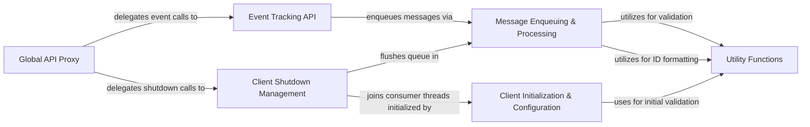

## Component Details

The Analytics Client API subsystem provides the primary interface for users to interact with the analytics system. It encompasses the initialization and configuration of the client, methods for tracking various analytics events, mechanisms for enqueuing and processing messages asynchronously, utility functions for data validation, and robust client shutdown management. Additionally, a global API proxy simplifies interaction by forwarding top-level calls to the underlying client instance.

### Client Initialization & Configuration
This component handles the setup of the Segment `Client` instance, including configuration parameters, queue initialization, and consumer thread management. It ensures the client is ready to process events.

**Related Classes/Methods**:

- <a href="https://github.com/segmentio/analytics-python/blob/master/segment/analytics/client.py#L48-L118" target="_blank" rel="noopener noreferrer">`segment.analytics.client.Client:__init__` (48:118)</a>

### Event Tracking API
This component provides the public methods for recording various analytics events such as `identify`, `track`, `alias`, `group`, `page`, and `screen`. These methods prepare the event data and delegate to the internal enqueuing mechanism.

**Related Classes/Methods**:

- <a href="https://github.com/segmentio/analytics-python/blob/master/segment/analytics/client.py#L120-L139" target="_blank" rel="noopener noreferrer">`segment.analytics.client.Client:identify` (120:139)</a>
- <a href="https://github.com/segmentio/analytics-python/blob/master/segment/analytics/client.py#L141-L163" target="_blank" rel="noopener noreferrer">`segment.analytics.client.Client:track` (141:163)</a>
- <a href="https://github.com/segmentio/analytics-python/blob/master/segment/analytics/client.py#L165-L182" target="_blank" rel="noopener noreferrer">`segment.analytics.client.Client:alias` (165:182)</a>
- <a href="https://github.com/segmentio/analytics-python/blob/master/segment/analytics/client.py#L184-L206" target="_blank" rel="noopener noreferrer">`segment.analytics.client.Client:group` (184:206)</a>
- <a href="https://github.com/segmentio/analytics-python/blob/master/segment/analytics/client.py#L208-L235" target="_blank" rel="noopener noreferrer">`segment.analytics.client.Client:page` (208:235)</a>
- <a href="https://github.com/segmentio/analytics-python/blob/master/segment/analytics/client.py#L237-L264" target="_blank" rel="noopener noreferrer">`segment.analytics.client.Client:screen` (237:264)</a>

### Message Enqueuing & Processing
This core component is responsible for validating, formatting, and adding analytics messages to an internal queue. It handles message ID generation, timestamp formatting, and ensures messages adhere to size limits before being passed to the underlying consumer for delivery.

**Related Classes/Methods**:

- <a href="https://github.com/segmentio/analytics-python/blob/master/segment/analytics/client.py#L266-L318" target="_blank" rel="noopener noreferrer">`segment.analytics.client.Client:_enqueue` (266:318)</a>

### Utility Functions
This component provides essential helper functions for data validation (`require`) and ID standardization (`stringify_id`), which are used across various parts of the client to ensure data integrity and consistency.

**Related Classes/Methods**:

- <a href="https://github.com/segmentio/analytics-python/blob/master/segment/analytics/client.py#L346-L350" target="_blank" rel="noopener noreferrer">`segment.analytics.client.require` (346:350)</a>
- <a href="https://github.com/segmentio/analytics-python/blob/master/segment/analytics/client.py#L353-L358" target="_blank" rel="noopener noreferrer">`segment.analytics.client.stringify_id` (353:358)</a>

### Client Shutdown Management
This component manages the graceful shutdown of the analytics client. It ensures that all pending messages in the queue are flushed to the server and that the consumer threads are properly terminated, preventing data loss or resource leaks.

**Related Classes/Methods**:

- <a href="https://github.com/segmentio/analytics-python/blob/master/segment/analytics/client.py#L340-L343" target="_blank" rel="noopener noreferrer">`segment.analytics.client.Client:shutdown` (340:343)</a>
- <a href="https://github.com/segmentio/analytics-python/blob/master/segment/analytics/client.py#L320-L326" target="_blank" rel="noopener noreferrer">`segment.analytics.client.Client.flush` (320:326)</a>
- <a href="https://github.com/segmentio/analytics-python/blob/master/segment/analytics/client.py#L328-L338" target="_blank" rel="noopener noreferrer">`segment.analytics.client.Client.join` (328:338)</a>

### Global API Proxy
This component provides a convenient, global-level interface for interacting with the Segment analytics client. It acts as a proxy, forwarding calls from top-level functions (like `analytics.track`) to the appropriate methods of the underlying `Client` instance.

**Related Classes/Methods**:

- `segment.analytics.track` (full file reference)
- `segment.analytics.identify` (full file reference)
- `segment.analytics.group` (full file reference)
- `segment.analytics.alias` (full file reference)
- `segment.analytics.page` (full file reference)
- `segment.analytics.screen` (full file reference)
- `segment.analytics.flush` (full file reference)
- `segment.analytics.join` (full file reference)
- `segment.analytics.shutdown` (full file reference)
- `segment.analytics._proxy` (full file reference)

### [FAQ](https://github.com/CodeBoarding/GeneratedOnBoardings/tree/main?tab=readme-ov-file#faq)