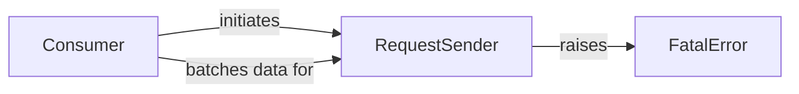

## Component Details

The Event Processor subsystem, primarily driven by the Consumer component, continuously processes and uploads collected analytics events. The Consumer retrieves batches from an event queue, prepares them, and then utilizes the RequestSender to initiate requests to the analytics service. The RequestSender handles the actual HTTP communication, including retry mechanisms and error handling, and can raise a FatalError to indicate unrecoverable issues, preventing further retries for a given operation.

### Consumer
The Consumer component is a daemon thread that continuously retrieves analytics events from a queue, batches them according to size and time limits, and initiates the upload process to the Segment API. It handles error reporting and manages retries for failed uploads.

**Related Classes/Methods**:

- <a href="https://github.com/segmentio/analytics-python/blob/master/segment/analytics/consumer.py#L25-L145" target="_blank" rel="noopener noreferrer">`analytics.consumer.Consumer` (25:145)</a>
- <a href="https://github.com/segmentio/analytics-python/blob/master/segment/analytics/consumer.py#L53-L59" target="_blank" rel="noopener noreferrer">`analytics.consumer.Consumer:run` (53:59)</a>
- <a href="https://github.com/segmentio/analytics-python/blob/master/segment/analytics/consumer.py#L65-L84" target="_blank" rel="noopener noreferrer">`analytics.consumer.Consumer:upload` (65:84)</a>
- <a href="https://github.com/segmentio/analytics-python/blob/master/segment/analytics/consumer.py#L86-L118" target="_blank" rel="noopener noreferrer">`analytics.consumer.Consumer:next` (86:118)</a>
- <a href="https://github.com/segmentio/analytics-python/blob/master/segment/analytics/consumer.py#L120-L145" target="_blank" rel="noopener noreferrer">`analytics.consumer.Consumer:request` (120:145)</a>

### RequestSender
The RequestSender component, encapsulated within the Consumer's request method, is responsible for executing the actual HTTP POST request to the Segment API. It implements a retry mechanism with exponential backoff for transient network or API errors and defines specific conditions under which an exception is considered fatal, preventing further retries.

**Related Classes/Methods**:

- `analytics.consumer.Consumer.request.send_request` (full file reference)

### FatalError
The FatalError component represents an exception type that signifies an unrecoverable error during the event processing and upload. When this error is raised, the system should not attempt further retries for the current operation.

**Related Classes/Methods**:

- <a href="https://github.com/segmentio/analytics-python/blob/master/segment/analytics/consumer.py#L17-L22" target="_blank" rel="noopener noreferrer">`analytics.consumer.FatalError` (17:22)</a>

### [FAQ](https://github.com/CodeBoarding/GeneratedOnBoardings/tree/main?tab=readme-ov-file#faq)