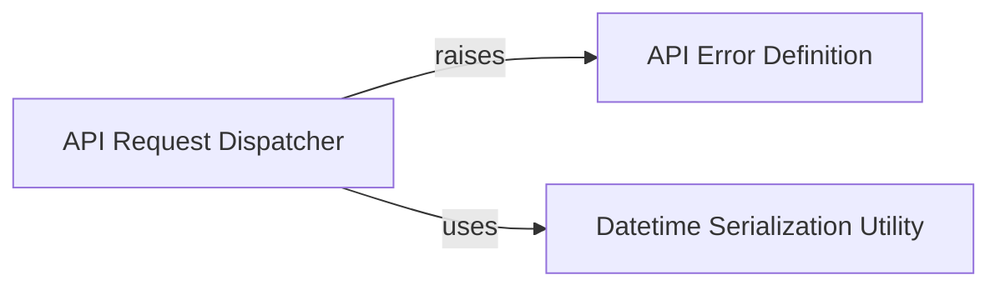

## Component Details

This subsystem is responsible for managing and executing HTTP POST requests to the Segment API. It handles the serialization of data, including special handling for datetime objects, applies compression if required, manages HTTP headers (including authorization), and provides robust error handling for API responses by raising a custom APIError for non-200 status codes.

### API Request Dispatcher
Manages the execution of HTTP POST requests to the Segment API, including data serialization, compression, header management, and robust error handling for API responses.

**Related Classes/Methods**:

- <a href="https://github.com/segmentio/analytics-python/blob/master/segment/analytics/request.py#L16-L73" target="_blank" rel="noopener noreferrer">`analytics-python.segment.analytics.request:post` (16:73)</a>

### API Error Definition
Defines the structure for errors encountered during API interactions, encapsulating the status code, error code, and message received from the Segment API for structured error handling.

**Related Classes/Methods**:

- <a href="https://github.com/segmentio/analytics-python/blob/master/segment/analytics/request.py#L76-L85" target="_blank" rel="noopener noreferrer">`analytics-python.segment.analytics.request.APIError` (76:85)</a>

### Datetime Serialization Utility
Provides a specialized JSON encoder for converting Python date and datetime objects into ISO 8601 format, ensuring proper serialization for API requests.

**Related Classes/Methods**:

- <a href="https://github.com/segmentio/analytics-python/blob/master/segment/analytics/request.py#L88-L93" target="_blank" rel="noopener noreferrer">`analytics-python.segment.analytics.request.DatetimeSerializer` (88:93)</a>

### [FAQ](https://github.com/CodeBoarding/GeneratedOnBoardings/tree/main?tab=readme-ov-file#faq)