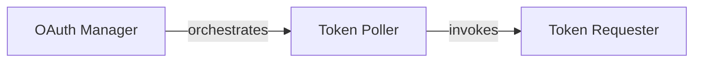

## Component Details

This subsystem, centered around the OAuth Manager, handles the complete OAuth authentication lifecycle. Its primary purpose is to ensure secure and continuous access to protected resources by managing the acquisition, refreshing, and invalidation of access tokens. The main flow involves the OAuth Manager initiating a polling mechanism (Token Poller) to periodically request and refresh tokens from the OAuth server, utilizing the Token Requester for the actual HTTP communication.

### OAuth Manager
Manages the entire OAuth authentication lifecycle, including requesting, refreshing, and invalidating access tokens. It orchestrates the polling mechanism and handles the overall state of the token, providing a public interface to retrieve the current token.

**Related Classes/Methods**:

- <a href="https://github.com/segmentio/analytics-python/blob/master/segment/analytics/oauth_manager.py#L15-L208" target="_blank" rel="noopener noreferrer">`analytics-python.segment.analytics.oauth_manager.OauthManager` (15:208)</a>
- <a href="https://github.com/segmentio/analytics-python/blob/master/segment/analytics/oauth_manager.py#L40-L64" target="_blank" rel="noopener noreferrer">`analytics-python.segment.analytics.oauth_manager.OauthManager:get_token` (40:64)</a>
- <a href="https://github.com/segmentio/analytics-python/blob/master/segment/analytics/oauth_manager.py#L66-L70" target="_blank" rel="noopener noreferrer">`analytics-python.segment.analytics.oauth_manager.OauthManager:clear_token` (66:70)</a>

### Token Poller
Responsible for periodically attempting to acquire or refresh an OAuth token. It incorporates retry logic, handles rate limiting responses, and manages various error conditions that may arise during the token acquisition process. It initiates requests to the Token Requester and updates the OAuth Manager with the token or errors.

**Related Classes/Methods**:

- <a href="https://github.com/segmentio/analytics-python/blob/master/segment/analytics/oauth_manager.py#L101-L208" target="_blank" rel="noopener noreferrer">`analytics-python.segment.analytics.oauth_manager.OauthManager:_poller_loop` (101:208)</a>

### Token Requester
Solely responsible for constructing and sending the HTTP POST request to the OAuth server's token endpoint. It generates the signed JWT (JSON Web Token) and formats the request body according to the OAuth 2.0 client credentials flow.

**Related Classes/Methods**:

- <a href="https://github.com/segmentio/analytics-python/blob/master/segment/analytics/oauth_manager.py#L72-L99" target="_blank" rel="noopener noreferrer">`analytics-python.segment.analytics.oauth_manager.OauthManager:_request_token` (72:99)</a>

### [FAQ](https://github.com/CodeBoarding/GeneratedOnBoardings/tree/main?tab=readme-ov-file#faq)