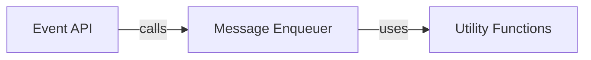

## Component Details

This graph illustrates the core components of the analytics-python library's message processing flow. The `Event API` serves as the primary interface for users to initiate various analytics events. These events are then passed to the `Message Enqueuer`, which handles the internal preparation and queuing of messages. During this preparation, the `Message Enqueuer` heavily relies on `Utility Functions` to validate input data and normalize message payloads, ensuring data quality and consistency before messages are dispatched for further processing.

### Event API
This component exposes the public methods for tracking various types of analytics events such as identify, track, alias, group, page, and screen. These methods serve as the primary interface for users of the analytics-python library to send data to Segment.

**Related Classes/Methods**:

- <a href="https://github.com/segmentio/analytics-python/blob/master/segment/analytics/client.py#L120-L139" target="_blank" rel="noopener noreferrer">`analytics-python.segment.analytics.client.Client:identify` (120:139)</a>
- <a href="https://github.com/segmentio/analytics-python/blob/master/segment/analytics/client.py#L141-L163" target="_blank" rel="noopener noreferrer">`analytics-python.segment.analytics.client.Client:track` (141:163)</a>
- <a href="https://github.com/segmentio/analytics-python/blob/master/segment/analytics/client.py#L165-L182" target="_blank" rel="noopener noreferrer">`analytics-python.segment.analytics.client.Client:alias` (165:182)</a>
- <a href="https://github.com/segmentio/analytics-python/blob/master/segment/analytics/client.py#L184-L206" target="_blank" rel="noopener noreferrer">`analytics-python.segment.analytics.client.Client:group` (184:206)</a>
- <a href="https://github.com/segmentio/analytics-python/blob/master/segment/analytics/client.py#L208-L235" target="_blank" rel="noopener noreferrer">`analytics-python.segment.analytics.client.Client:page` (208:235)</a>
- <a href="https://github.com/segmentio/analytics-python/blob/master/segment/analytics/client.py#L237-L264" target="_blank" rel="noopener noreferrer">`analytics-python.segment.analytics.client.Client:screen` (237:264)</a>

### Message Enqueuer
This component is responsible for the internal processing and queuing of analytics messages before they are dispatched. It handles tasks such as generating timestamps and message IDs, performing initial data cleaning, and adding the prepared messages to an internal queue for asynchronous sending.

**Related Classes/Methods**:

- <a href="https://github.com/segmentio/analytics-python/blob/master/segment/analytics/client.py#L48-L118" target="_blank" rel="noopener noreferrer">`analytics-python.segment.analytics.client.Client:__init__` (48:118)</a>
- <a href="https://github.com/segmentio/analytics-python/blob/master/segment/analytics/client.py#L266-L318" target="_blank" rel="noopener noreferrer">`analytics-python.segment.analytics.client.Client:_enqueue` (266:318)</a>

### Utility Functions
Provides a collection of general-purpose helper functions for tasks such as timezone guessing, recursive data cleaning (removing null/empty values), data type coercion, and input validation, ensuring data conforms to expected formats and is properly formatted before transmission.

**Related Classes/Methods**:

- <a href="https://github.com/segmentio/analytics-python/blob/master/segment/analytics/utils.py#L24-L37" target="_blank" rel="noopener noreferrer">`analytics-python.segment.analytics.utils:guess_timezone` (24:37)</a>
- <a href="https://github.com/segmentio/analytics-python/blob/master/segment/analytics/utils.py#L46-L59" target="_blank" rel="noopener noreferrer">`analytics-python.segment.analytics.utils:clean` (46:59)</a>
- <a href="https://github.com/segmentio/analytics-python/blob/master/segment/analytics/utils.py#L62-L63" target="_blank" rel="noopener noreferrer">`analytics-python.segment.analytics.utils:_clean_list` (62:63)</a>
- <a href="https://github.com/segmentio/analytics-python/blob/master/segment/analytics/utils.py#L66-L77" target="_blank" rel="noopener noreferrer">`analytics-python.segment.analytics.utils:_clean_dict` (66:77)</a>
- <a href="https://github.com/segmentio/analytics-python/blob/master/segment/analytics/utils.py#L12-L14" target="_blank" rel="noopener noreferrer">`analytics-python.segment.analytics.utils.is_naive` (12:14)</a>
- <a href="https://github.com/segmentio/analytics-python/blob/master/segment/analytics/utils.py#L17-L21" target="_blank" rel="noopener noreferrer">`analytics-python.segment.analytics.utils.total_seconds` (17:21)</a>
- <a href="https://github.com/segmentio/analytics-python/blob/master/segment/analytics/utils.py#L80-L88" target="_blank" rel="noopener noreferrer">`analytics-python.segment.analytics.utils._coerce_unicode` (80:88)</a>
- <a href="https://github.com/segmentio/analytics-python/blob/master/segment/analytics/client.py#L346-L350" target="_blank" rel="noopener noreferrer">`analytics-python.segment.analytics.client.require` (346:350)</a>
- <a href="https://github.com/segmentio/analytics-python/blob/master/segment/analytics/client.py#L353-L358" target="_blank" rel="noopener noreferrer">`analytics-python.segment.analytics.client.stringify_id` (353:358)</a>

### [FAQ](https://github.com/CodeBoarding/GeneratedOnBoardings/tree/main?tab=readme-ov-file#faq)