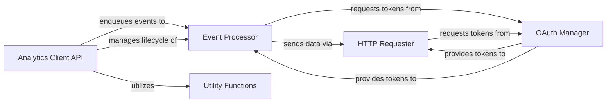

## Component Details

The `analytics-python` project provides a client library for sending analytics data to Segment. The core functionality revolves around an `Analytics Client API` that allows users to track various events. These events are enqueued and then asynchronously processed by an `Event Processor`, which batches and uploads them. The actual data transmission is handled by an `HTTP Requester`, which communicates with the Segment API. Authentication for these requests is managed by an `OAuth Manager`, responsible for token acquisition and refreshing. Various `Utility Functions` support data preparation and validation across the system.

### Analytics Client API
The primary interface for users to interact with the analytics system, providing methods for various analytics actions (identify, track, page, screen, group, alias) and managing the client's lifecycle (flush, join, shutdown). It enqueues events for asynchronous processing.

**Related Classes/Methods**:

- <a href="https://github.com/segmentio/analytics-python/blob/master/segment/analytics/client.py#L21-L343" target="_blank" rel="noopener noreferrer">`analytics-python.segment.analytics.client.Client` (21:343)</a>
- <a href="https://github.com/segmentio/analytics-python/blob/master/segment/analytics/client.py#L48-L118" target="_blank" rel="noopener noreferrer">`analytics-python.segment.analytics.client.Client:__init__` (48:118)</a>
- <a href="https://github.com/segmentio/analytics-python/blob/master/segment/analytics/client.py#L120-L139" target="_blank" rel="noopener noreferrer">`analytics-python.segment.analytics.client.Client:identify` (120:139)</a>
- <a href="https://github.com/segmentio/analytics-python/blob/master/segment/analytics/client.py#L141-L163" target="_blank" rel="noopener noreferrer">`analytics-python.segment.analytics.client.Client:track` (141:163)</a>
- <a href="https://github.com/segmentio/analytics-python/blob/master/segment/analytics/client.py#L165-L182" target="_blank" rel="noopener noreferrer">`analytics-python.segment.analytics.client.Client:alias` (165:182)</a>
- <a href="https://github.com/segmentio/analytics-python/blob/master/segment/analytics/client.py#L184-L206" target="_blank" rel="noopener noreferrer">`analytics-python.segment.analytics.client.Client:group` (184:206)</a>
- <a href="https://github.com/segmentio/analytics-python/blob/master/segment/analytics/client.py#L208-L235" target="_blank" rel="noopener noreferrer">`analytics-python.segment.analytics.client.Client:page` (208:235)</a>
- <a href="https://github.com/segmentio/analytics-python/blob/master/segment/analytics/client.py#L237-L264" target="_blank" rel="noopener noreferrer">`analytics-python.segment.analytics.client.Client:screen` (237:264)</a>
- <a href="https://github.com/segmentio/analytics-python/blob/master/segment/analytics/client.py#L266-L318" target="_blank" rel="noopener noreferrer">`analytics-python.segment.analytics.client.Client:_enqueue` (266:318)</a>
- <a href="https://github.com/segmentio/analytics-python/blob/master/segment/analytics/client.py#L340-L343" target="_blank" rel="noopener noreferrer">`analytics-python.segment.analytics.client.Client:shutdown` (340:343)</a>
- <a href="https://github.com/segmentio/analytics-python/blob/master/segment/analytics/client.py#L320-L326" target="_blank" rel="noopener noreferrer">`analytics-python.segment.analytics.client.Client.flush` (320:326)</a>
- <a href="https://github.com/segmentio/analytics-python/blob/master/segment/analytics/client.py#L328-L338" target="_blank" rel="noopener noreferrer">`analytics-python.segment.analytics.client.Client.join` (328:338)</a>
- `analytics-python.segment.analytics:track` (full file reference)
- `analytics-python.segment.analytics:identify` (full file reference)
- `analytics-python.segment.analytics:group` (full file reference)
- `analytics-python.segment.analytics:alias` (full file reference)
- `analytics-python.segment.analytics:page` (full file reference)
- `analytics-python.segment.analytics:screen` (full file reference)
- `analytics-python.segment.analytics:flush` (full file reference)
- `analytics-python.segment.analytics:join` (full file reference)
- `analytics-python.segment.analytics:shutdown` (full file reference)
- `analytics-python.segment.analytics._proxy` (full file reference)

### Event Processor
Continuously processes and uploads collected analytics events. It retrieves batches from the event queue, prepares them, and initiates requests to the analytics service, managing upload intervals, batch sizes, and retries.

**Related Classes/Methods**:

- <a href="https://github.com/segmentio/analytics-python/blob/master/segment/analytics/consumer.py#L25-L145" target="_blank" rel="noopener noreferrer">`analytics-python.segment.analytics.consumer.Consumer` (25:145)</a>
- <a href="https://github.com/segmentio/analytics-python/blob/master/segment/analytics/consumer.py#L53-L59" target="_blank" rel="noopener noreferrer">`analytics-python.segment.analytics.consumer.Consumer:run` (53:59)</a>
- <a href="https://github.com/segmentio/analytics-python/blob/master/segment/analytics/consumer.py#L65-L84" target="_blank" rel="noopener noreferrer">`analytics-python.segment.analytics.consumer.Consumer:upload` (65:84)</a>
- <a href="https://github.com/segmentio/analytics-python/blob/master/segment/analytics/consumer.py#L86-L118" target="_blank" rel="noopener noreferrer">`analytics-python.segment.analytics.consumer.Consumer.next` (86:118)</a>
- <a href="https://github.com/segmentio/analytics-python/blob/master/segment/analytics/consumer.py#L120-L145" target="_blank" rel="noopener noreferrer">`analytics-python.segment.analytics.consumer.Consumer:request` (120:145)</a>
- `analytics-python.segment.analytics.consumer.Consumer.request.send_request` (full file reference)
- <a href="https://github.com/segmentio/analytics-python/blob/master/segment/analytics/consumer.py#L17-L22" target="_blank" rel="noopener noreferrer">`analytics-python.segment.analytics.consumer.FatalError` (17:22)</a>

### HTTP Requester
Manages the execution of HTTP POST requests to the Segment API, including data serialization, compression, header management, and robust error handling for API responses.

**Related Classes/Methods**:

- <a href="https://github.com/segmentio/analytics-python/blob/master/segment/analytics/request.py#L16-L73" target="_blank" rel="noopener noreferrer">`analytics-python.segment.analytics.request:post` (16:73)</a>
- <a href="https://github.com/segmentio/analytics-python/blob/master/segment/analytics/request.py#L76-L85" target="_blank" rel="noopener noreferrer">`analytics-python.segment.analytics.request.APIError` (76:85)</a>
- <a href="https://github.com/segmentio/analytics-python/blob/master/segment/analytics/request.py#L88-L93" target="_blank" rel="noopener noreferrer">`analytics-python.segment.analytics.request.DatetimeSerializer` (88:93)</a>

### OAuth Manager
Handles the OAuth authentication lifecycle, including requesting, refreshing, and invalidating access tokens through a polling mechanism to ensure secure and continuous access to protected resources.

**Related Classes/Methods**:

- <a href="https://github.com/segmentio/analytics-python/blob/master/segment/analytics/oauth_manager.py#L15-L208" target="_blank" rel="noopener noreferrer">`analytics-python.segment.analytics.oauth_manager.OauthManager` (15:208)</a>
- <a href="https://github.com/segmentio/analytics-python/blob/master/segment/analytics/oauth_manager.py#L40-L64" target="_blank" rel="noopener noreferrer">`analytics-python.segment.analytics.oauth_manager.OauthManager:get_token` (40:64)</a>
- <a href="https://github.com/segmentio/analytics-python/blob/master/segment/analytics/oauth_manager.py#L66-L70" target="_blank" rel="noopener noreferrer">`analytics-python.segment.analytics.oauth_manager.OauthManager:clear_token` (66:70)</a>
- <a href="https://github.com/segmentio/analytics-python/blob/master/segment/analytics/oauth_manager.py#L72-L99" target="_blank" rel="noopener noreferrer">`analytics-python.segment.analytics.oauth_manager.OauthManager:_request_token` (72:99)</a>
- <a href="https://github.com/segmentio/analytics-python/blob/master/segment/analytics/oauth_manager.py#L101-L208" target="_blank" rel="noopener noreferrer">`analytics-python.segment.analytics.oauth_manager.OauthManager:_poller_loop` (101:208)</a>

### Utility Functions
Provides a collection of general-purpose helper functions for tasks such as timezone guessing, recursive data cleaning (removing null/empty values), data type coercion, and input validation.

**Related Classes/Methods**:

- <a href="https://github.com/segmentio/analytics-python/blob/master/segment/analytics/utils.py#L24-L37" target="_blank" rel="noopener noreferrer">`analytics-python.segment.analytics.utils:guess_timezone` (24:37)</a>
- <a href="https://github.com/segmentio/analytics-python/blob/master/segment/analytics/utils.py#L46-L59" target="_blank" rel="noopener noreferrer">`analytics-python.segment.analytics.utils:clean` (46:59)</a>
- <a href="https://github.com/segmentio/analytics-python/blob/master/segment/analytics/utils.py#L62-L63" target="_blank" rel="noopener noreferrer">`analytics-python.segment.analytics.utils:_clean_list` (62:63)</a>
- <a href="https://github.com/segmentio/analytics-python/blob/master/segment/analytics/utils.py#L66-L77" target="_blank" rel="noopener noreferrer">`analytics-python.segment.analytics.utils:_clean_dict` (66:77)</a>
- <a href="https://github.com/segmentio/analytics-python/blob/master/segment/analytics/utils.py#L12-L14" target="_blank" rel="noopener noreferrer">`analytics-python.segment.analytics.utils.is_naive` (12:14)</a>
- <a href="https://github.com/segmentio/analytics-python/blob/master/segment/analytics/utils.py#L17-L21" target="_blank" rel="noopener noreferrer">`analytics-python.segment.analytics.utils.total_seconds` (17:21)</a>
- <a href="https://github.com/segmentio/analytics-python/blob/master/segment/analytics/utils.py#L80-L88" target="_blank" rel="noopener noreferrer">`analytics-python.segment.analytics.utils._coerce_unicode` (80:88)</a>
- <a href="https://github.com/segmentio/analytics-python/blob/master/segment/analytics/client.py#L346-L350" target="_blank" rel="noopener noreferrer">`analytics-python.segment.analytics.client.require` (346:350)</a>
- <a href="https://github.com/segmentio/analytics-python/blob/master/segment/analytics/client.py#L353-L358" target="_blank" rel="noopener noreferrer">`analytics-python.segment.analytics.client.stringify_id` (353:358)</a>

### [FAQ](https://github.com/CodeBoarding/GeneratedOnBoardings/tree/main?tab=readme-ov-file#faq)